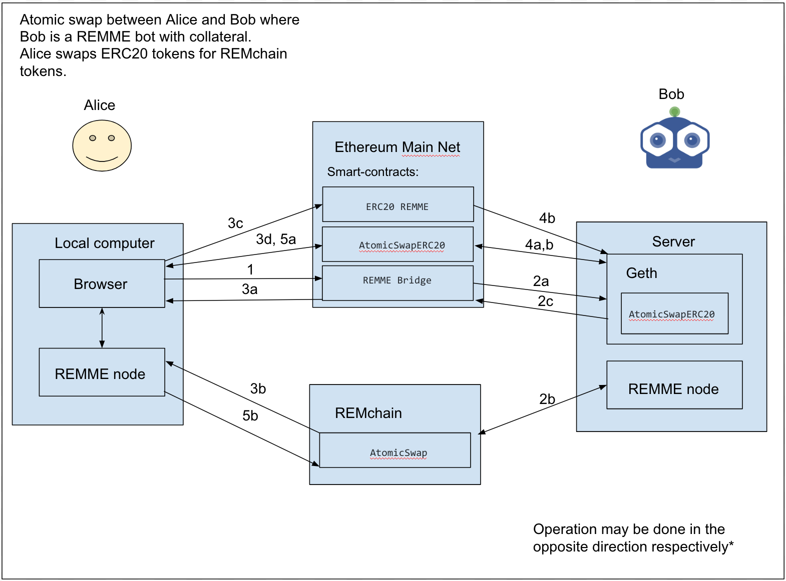

******************************
Atomic Swap Transaction Family
******************************

Overview
========

The Atomic Swap transaction family provides means for universal exchange between two agents in separate chains.

There are a few definitions we introduce to formalise agent names during the exchange:

*Initiator* - An agent requesting the atomic swap.

*Solicitor* - An agent hosting the swap and ready to solicit the exchange.

.. note::

	Currently, REMchain provides a bot for liquidity who *solicites* the exchange in the most demanded 1:1 ETH REMME Token <=> REMchain Tokens swaps.

State
=====

During the initialisation process of the swap, the *initiator* generates a random "swap_id", the hash of which is used for addressing the swap information.

Definition of Atomic-Swap Entries
---------------------------------

The following protocol buffers definition defines atomic swap entries:

.. code-block:: protobuf

    message AtomicSwapInfo {
        bool is_closed = 1; // if the swap is closed and unavailable for actions upon it
        bool is_approved = 11; // if Alice approved the swap, initiated by herself
        string sender_address = 2; // Address of the agent on the REMchain side soliciting the exchange
        string sender_address_non_local = 12; // Address to receive arranged equivalent on the other chain (non local one)
        string receiver_address = 3; // REMchain agent to receive funds
        uint64 amount = 4; // The amount to be transferred
        string email_address_encrypted_optional = 5; // email address for solicitor (Bob) to notify the swap initiator (Alice)
        string swap_id = 6; // Swap unique id
        string secret_lock = 7; // A secret lock to successfuly match with a secret_key and close the swap
        string secret_key = 8; // Last step information, provided to as a secret for solicitor
        uint32 created_at = 9; // Creation date in a timestamp format
        bool is_initiator = 10; // check weather REMchain side initiated the swap (not a solicitor)
    }

Addressing
----------

The address of an entity on the storage is built as follows (where ``sha512(text)``):

.. code-block:: python

    address = hash512('AtomicSwap')[:6] + hash512(swap_id)[:64]

Transaction Payload
===================

Account transaction family payloads are defined by the following protocol
buffers code:

.. code-block:: protobuf

    // Init Payload
    message AtomicSwapInitPayload {
        string receiver_address = 1; // REMchain agent to receive funds
        string sender_address_non_local = 7; // Address to receive arranged equivalent on the other chain (non local one)
        uint64 amount = 2; // The amount to be transferred
        string swap_id = 3; // Swap unique id
        string secret_lock_by_solicitor = 4; // A secret lock, provided during initialisation, only if REMchain side is a solicitor (non initiator)
        string email_address_encrypted_by_initiator = 5; // An email address provided by swap initiator (Alice) to be notified of the next step
        uint32 created_at = 6; // Creation date in a timestamp format
    }

    message AtomicSwapApprovePayload {
        string swap_id = 1;
    }

    message AtomicSwapExpirePayload {
        string swap_id = 1;
    }

    message AtomicSwapSetSecretLockPayload {
        string swap_id = 1;
        string secret_lock = 2;
    }

    message AtomicSwapClosePayload {
        string swap_id = 1;
        string secret_key = 2;
    }

Transaction Header
==================

Inputs and Outputs
------------------

.. note::

    Some address abbreviations are:

    * **Signer's account address** - formed from a public key of a transaction signer.
    * **Swap address** - 70 characters concatenation of 6 chars atomic swap family prefix + 64 chars hash of the swap id.
    * **ZERO_ADDRESS** - reserved address used for locking funds *on chain*.
    * **SETTINGS_SWAP_COMMISSION** - *settings* address for retrieving operation commision amount
    * **SETTINGS_KEY_GENESIS_OWNERS** - *settings* address for retrieving list of addresses which has access to send tokens
    * **CONFIG_ADDRESS** - address for retrieving block configuration info
    * **BLOCK_INFO_NAMESPACE** - namespace for retrieving any block info (in this case the latest one from block config)

The inputs and outputs for account family transactions in respect to their payloads refer to following addresses:

* **InitPayload**: Swap address, signer's and funds receiver's account addresses, ZERO_ADDRESS, SETTINGS_SWAP_COMMISSION, SETTINGS_KEY_GENESIS_OWNERS, CONFIG_ADDRESS (only input), BLOCK_INFO_NAMESPACE (only input)
* **AtomicSwapApprovePayload**: Swap address
* **AtomicSwapExpirePayload**: Swap address, ZERO_ADDRESS, signer's account address, CONFIG_ADDRESS (only input), BLOCK_INFO_NAMESPACE (only input), SETTINGS_KEY_GENESIS_OWNERS
* **AtomicSwapSetSecretLockPayload**: Swap address
* **AtomicSwapClosePayload**: Swap address, ZERO_ADDRESS, receiver's account address, SETTINGS_KEY_GENESIS_OWNERS

Family
------

- family_name: "AtomicSwap"
- family_version: "0.1"

Encoding
--------

The encoding field must be set to "application/protobuf".

Atomic Swap High-level Process
------------------------------

Atomic Swap between two agents
When performing an atomic swap between ERC20 and REMME, the AtomicSwapERC20 contract should be used. For this example, Alice holds REMME ERC20 tokens and Bob also holds REMchain tokens. Alice is looking to give her ERC20 tokens to Bob in exchange for his REMME tokens.

1. Bob generates a random secret key and hashes it using SHA256 to generate a secret lock.

2. Bob uses the secret lock, and a REMME transaction, to setup a transaction to Alice on the condition that she produces the secret key. If she does not do so within 48 hours then Bob can withdraw the funds.

3. Bob sends the secret lock to Alice along with the address of his transaction on the REMME blockchain.

4. Alice checks Bob's transaction, verifying the details of the trade. If she does not agree then she does not need to do anything. After 48 hours, Bob can withdraw his funds.

5. Alice provides an allowance to the AtomicSwapERC20 contract, using her ERC20 contract to do so.

6. Alice calls open using a unique _swapID that has been negotiated between both traders. She also uses the secret lock that was provided by Bob. The allowance will be checked and used to transfer Alice's ERC20 tokens to the AtomicSwapERC20 contract.

7. Bob calls check to verify the details of the trade. If he does not agree, then he does not need to do anything. After 24 hours, Alice can call expire, getting a refund of her ERC20 tokens.

8. Bob calls close, which requires that he submits the secret key associated with the secret lock. If he has provided the correct secret key, it will transfer Alice's ERC20 tokens to Bob and store the secret key.

9. Alice calls checkSecretKey, acquiring the secret key.

10. Alice provides the secret key to Bob's Swap Handler, and receives his REMME tokens.

Atomic Swap ETH => REMchain with a REMME bot
--------------------------------------------
Illustration of the implementation

1. Alice wants to show intention for atomic swap with Bob. She calls “REMME Bridge” method `requestSwap`, she wants to receive in REMchain tokens, so she provides the amount and her REMchain address. Alice starts watching “REMME Bridge” for transactions.

2. Bob sees the method call to the “REMME Bridge”, of which he is owner.
    a) He generates random secret key and hashes it (producing a secret lock). He also generates _swapID to reference the swap in AtomicSwapERC20.
    b) He sends swap transaction to Alice’s address with a secret lock on REMchain with the condition that Alice will provide the right secret key in the next 48 hours, otherwise Bob will be able to withdraw funds.
    c) Bob sends “REMME Bridge” transaction via `returnSecretLock` where he passes address of the REMchain transaction, generated _swapID and his Ethereum address.

3. Alice checks “REMME Bridge” for Bob’s transaction using `check` which uses    her ethereum address for current transaction state information.
    a) She receives a secret lock, a _swapID and Bob’s eth address.
    b) Now she verifies details of Bob’s transaction and makes sure it was created in the past hour (if transaction_id was provided after 24 hours, Bob may withdraw both chain’s funds) if she doesn’t agree to details, she doesn’t have to do anything. (in 48 hours Bob can withdraw his funds)
    c) If she agrees, she gives allowance to transfer ERC20 REMME token to AtomiSwapERC20 contract and provides.
    d) Alice calls open using a unique _swapID that has been negotiated between both traders and Bob’s eth-address. She also uses the secret lock that was provided by Bob. The allowance will be checked and used to transfer Alice's ERC20 tokens to the AtomicSwapERC20 contract.

4. Bob calls check to verify the details of the trade using _swapID.
    a) If he doesn’t agree, he doesn’t have to do anything (he will be able to withdraw his funds in 48 hours)
    b) Bob calls close, which requires that he submits the secret key associated with the secret lock. If he has provided the correct secret key, it will transfer Alice's ERC20 tokens to Bob and store the secret key.

5. Alice notices related transaction to AtomicSwapERC20
    a) She calls checkSecretKey, acquiring the secret key
    b) Alice provides the secret key to Bob's Swap Handler, and receives his REMME tokens.