********
Web Auth
********

Overview
========

One of the most prominent needs of any organisation and platform is to authenticate and authorize its members.

In order to help with affairs, REMME has built web auth demo of how a secure login systems works and how to implement it.

We've developed a login mechanism with REMchain storage in mind to check against user certificate's hash and its validity.

Addiotionally, We added support to a 2nd factor option such as Google Authenticator in case of a certificate being stolen by the third party.

You may check out the live version at `Web Auth Demo <https://webauth-testnet.remme.io/register>`_

************************
How to use Web Auth Demo
************************

1. Generate a keystore file
===========================

1. Before proceeding to demo, one needs to generate a keystore file, which is used whenever user sends a transaction to REMchain and has the following form:

.. code-block:: json

 {
  "publicKey":"0205af8af2b75bbab7197bee761329ea9294c65e2d127c66344d5c629b3f8aa72a",
  "privateKey":"67cc68c0eb28224def574bb646a621cb1fdc0665260ecc63c3d5090a425a3a97"
 }

It can be generated in the form by clicking *Claim Tokens* button in `Blockchain explorer <https://blockexplorer.remme.io/>`_ at the top right corner.

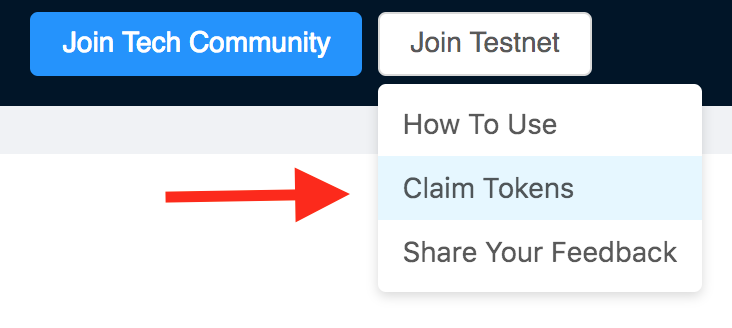

Then one needs to generate a `keystore.txt` file and enter public key information from its contents:

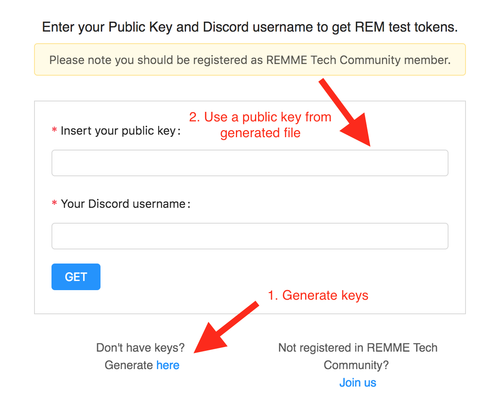

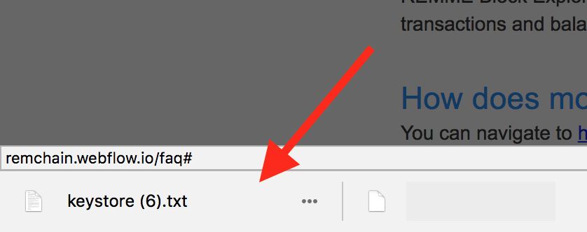

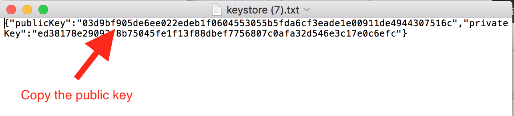

2. Afterwards, in order to create a certificate, one has to get some tokens on their balance. Thus by providing a Discord nickname in the very same form and pressing "Submit", the public key provided will receive tokens to its address.

.. note::

 You may check if tokens are refilled by monitoring `Block Explorer <https://blockexplorer.remme.io/>`_ for your transaction.

 .. figure:: img/web-auth/remme-blockchain-explorer-recent.png

2. Generate and register a certificate
======================================

1. Go to `Web Auth Register Page <https://webauth-testnet.remme.io/register>`_ where you will be asked to provide a REMchain keystore file you have just received.

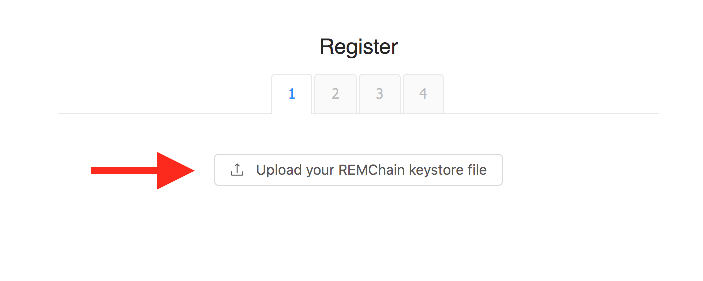

2. Provide certificate details. Some general information about the owner as well as certificate password for local keychain for MacOS storage is required (other OS's is optional). Then press "Create User" and the transaction on the blockchain will be sent for you.

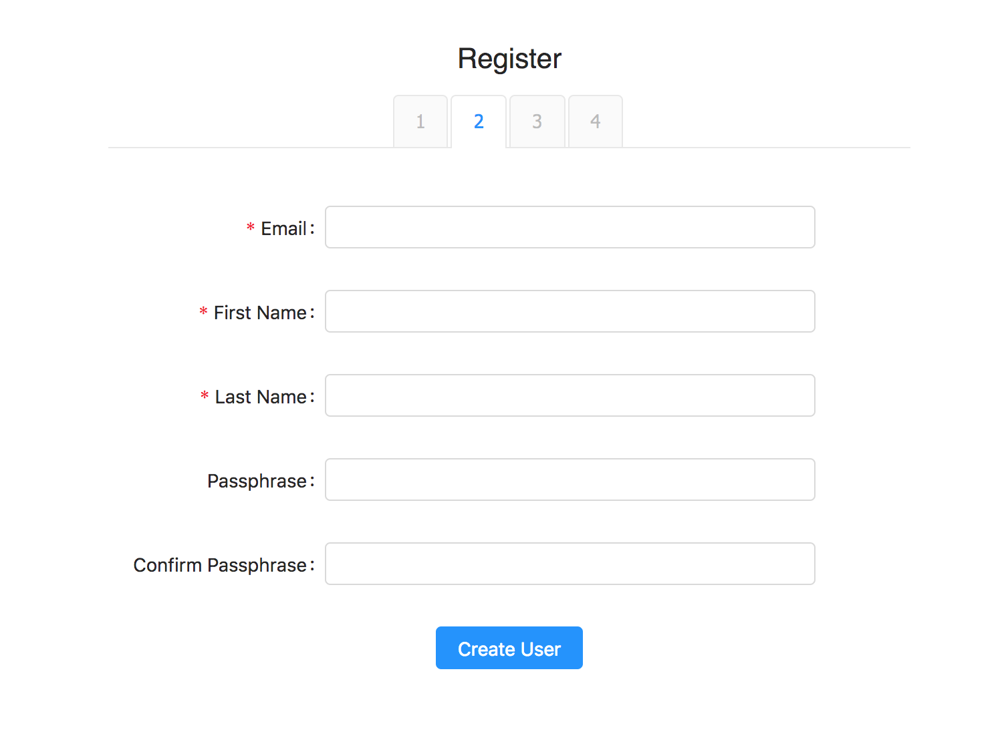

3. You may see the transaction appeared on the blockchain. At this point you will be asked weather you would like to add additional measure of security such as a second factor authentication.

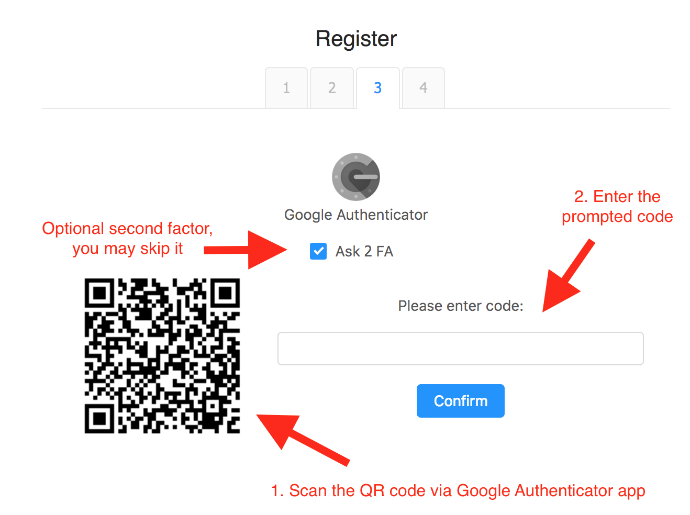

4. Success 🎉 . A new certificate was registered on the REMchain.

3. Save the certificate to local keystore
=========================================

If everything went well, the certificate with a `.p12` extension was downloaded.

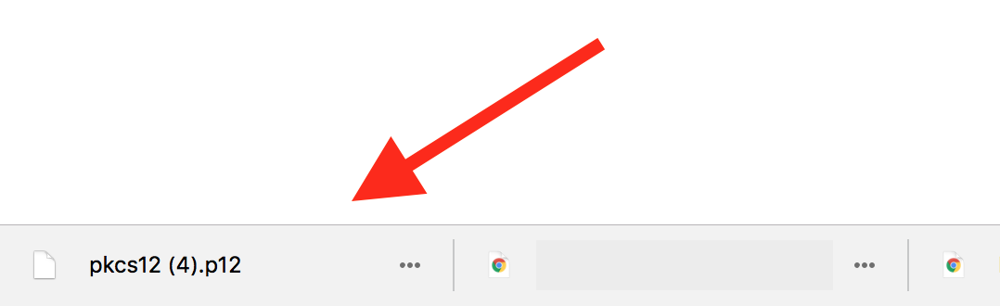

To save it to your local keystore, it is enough to open the file and follow instructions.
You will be asked to enter the password you mentioned during the registration step above.

.. note::
 In case of a Firefox browser, one needs to import the certificate manually with the following instructions:

 `Preferences > Advanced > "Certificates" tab > View Certificates > "Your certificates" tab > Import`

 Choose the certificate, then enter its' password and press OK. New certificate was successfully imported into Firefox browser.

4. Login using certificate
==========================

1. Once a certificate is generated and stored on a user's local storage, one may log into the system by visiting `Login Page <https://webauth-testnet.remme.io/login/>`_

2. By clicking on a "login" button, a user will be prompted to choose a certificate for authentication purposes.

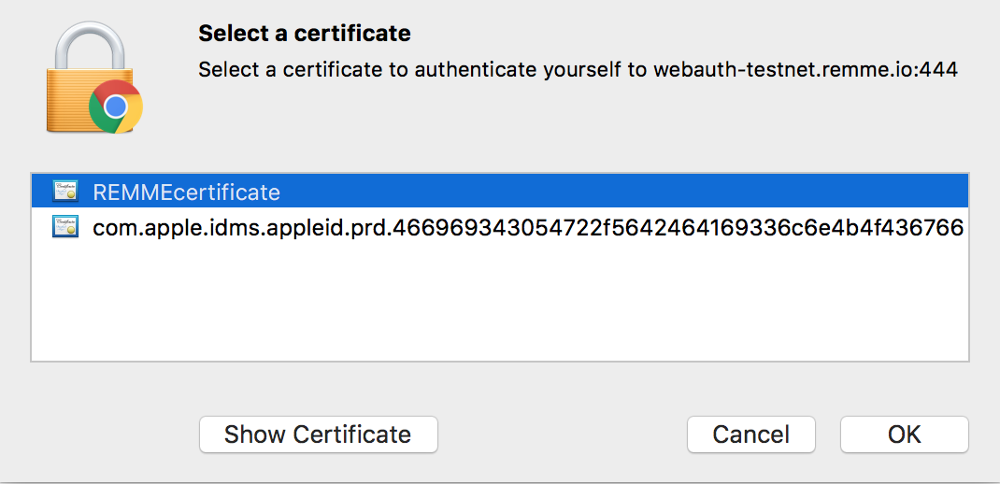

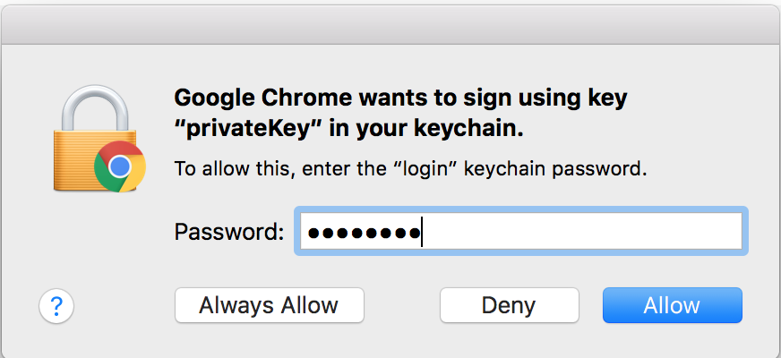

3. The next step will prompt to perform the 2nd factor, if one has check-marked during the registration step. Press "Login" to skip the step or enter the secret code.

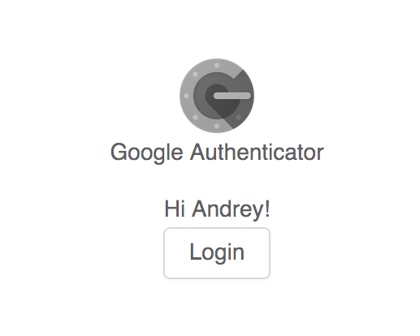

4. Success. You are now logged in using your certificate! You will be directed to a classified resource.

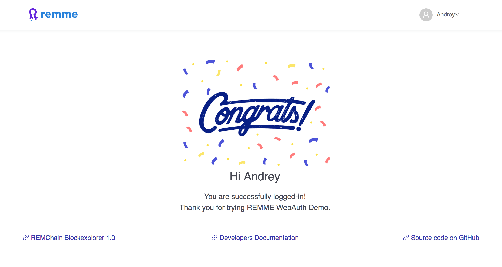

Revoke certificate (Optional)
=============================

At one point, the certificate may loose its actuallity die to organisation member leaving the company or the certificate gets compromised.

1. At the right upper corner, by clicking a dropdown arrow, one will find a "Revoke" button, which allows to revoke current certificate one has logged in with.

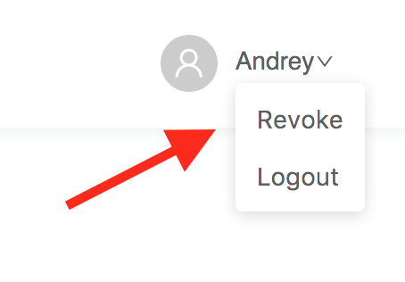

2. Once you expired the certificate, it is recommended to remove it locally: for MacOS user from the key chain (Chrome: Settings => Search for "Manage Certificates") and if Firefox browser is used - one has to remove it from preferences:

.. note::

 In case of a Firefox browser, in order to delete the certificate, do the the following:

 `Preferences > Advanced > "Certificates" tab > View Certificates > "Your certificates" tab > Right click old certificate > Delete`

***********************
How to run DEMO locally
***********************
For installation instructions of the demo, please visit `Web Auth Demo on Github <https://github.com/Remmeauth/remme-webauth-testnet/>`_.
